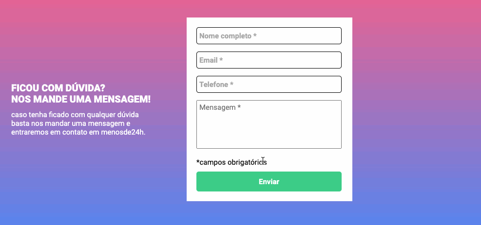

# Validação de Formulário
### Este projeto é um desafio do curso DevQuest - Dev em dobro.
#### Ao clicar para enviar o formulário, se caso algum campo não estiver preenchido, o mesmo ficará com a borda do campo em vermelho e uma mensagem de "campo obrigatorio" deverá aparecer embaixo. O Formulário será enviado apenas se todos os campos estiver preenchido corretamente, a borda ficará verde indicando a validação.

## Tecnologias:
- HTML
- CSS
- JavaScrispt